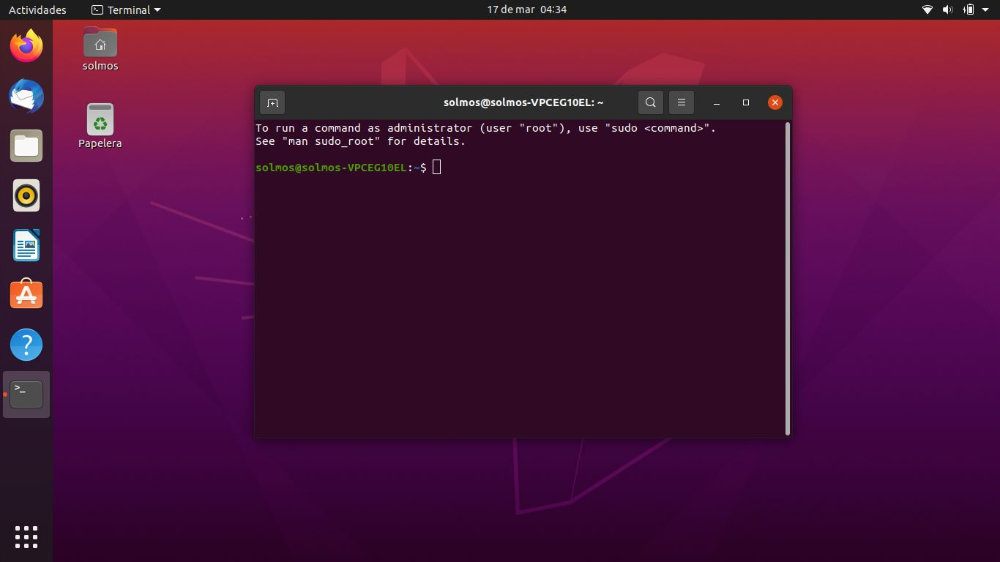

|
Instalación de python y librerias en Linux (Debian / Ubuntu)
=======

Primero hay que revisar si su sistema tiene python3 instalado, para esto abra su terminal

Ejecute ``python`` o ``python3``. Si la respuesta es algo del tipo:

    Python 3.6.6 (default, Sep 12 2018, 18:26:19)
    [GCC 8.0.1 20180414 (experimental) [trunk revision 259383]] on linux
    Type "help", "copyright", "credits" or "license" for more information.
    >>>

y la numeración de python es 3.6 o superior, felicidades, usted ya tiene python 3 instalado.

Si la numeración indica python 2.7.x o similar, o el comando python3 no es encontrado, usted necesita instalar python 3.

El símbolo >>> indica el lugar donde usted puede enviar comandos al intérprete de python. Ejecutando quit() usted cierra dicho intérprete.

Instalación de python3
----------------------

En la terminal ejecute:

    sudo apt-get update

Para actualizar su repositorio de software. Luego instale python 3 con:

    sudo apt-get install python3 python3-dev

Se le pedirá su contraseña de sistema, ingrésela y luego ingrese 'y' o 's' para comenzar la instalación.

Para poder instalar las distintas librerías instalaremos 'pip' que es un administrador de librerías python.

    sudo apt-get install python3-pip

Creando un environment
----------------------

Existen múltiples librerías para python. Algunas incompatibles entre si debido a distintos requerimientos de versiones. Es posible crear distintos ambientes de trabajo para tener ejecutables de python con distintas librerías específicas según sea el caso. Se recomienda instalar todas las librerías para el curso en un environment dedicado. Así no interfiere con pythons que pueda utilizar para otros fines.

Para crear un environment con python, primero instale virtualenv con

    sudo apt-get install python3-venv

Luego cree un ambiente de python una carpeta de su home con ~/python-cg (puede utilizar otra ruta si lo desea).

    python3 -venv python-cg

Si no funciona puede crear directamente la carpeta con el environment, ejecutando

    python3 -m venv python-cg

Instalando librerías
--------------------

Primero active su environment python3 con

    source ~/python-cg/bin/activate

Aparecerá (python-cg) al lado izquierdo de su prompt, indicando que dicho environment se encuentra activo.

Puede probar que la versión de python activa es la que se encuentra en su environment con

    which python

La respuesta debiera ser

    /home/[username]/python-cg/bin/python

También verifique pip, con:

    which pip

La respuesta debiera ser

    /home/[username]/python-cg/bin/pip

Instalemos algunas dependencias necesarias:

    sudo apt-get install python3-dev libglfw3 libglfw3-dev

Ahora instalamos todas las librerias python requeridas

    pip install numpy scipy matplotlib ipython jupyter pyopengl glfw pillow imgui[glfw] pyglet trimesh networkx

Siempre es posible instalar cada librería por separado.
