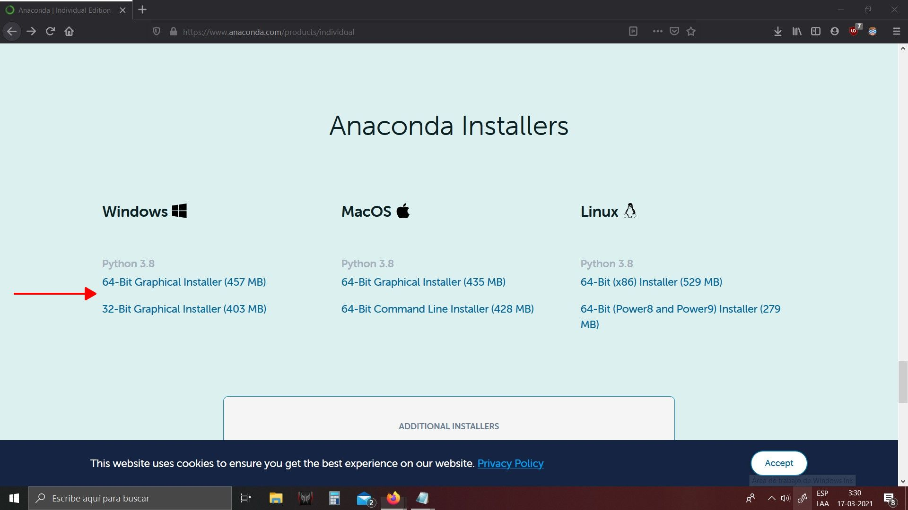
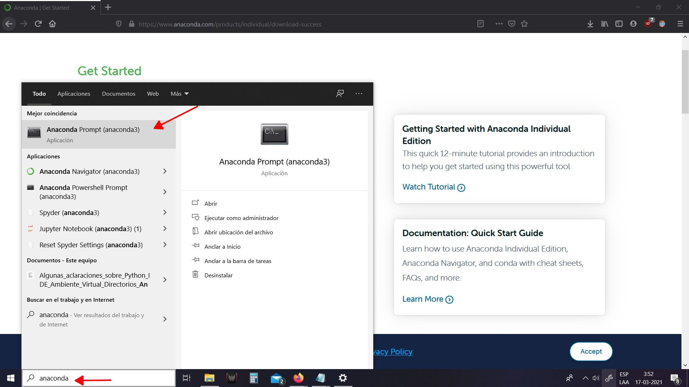
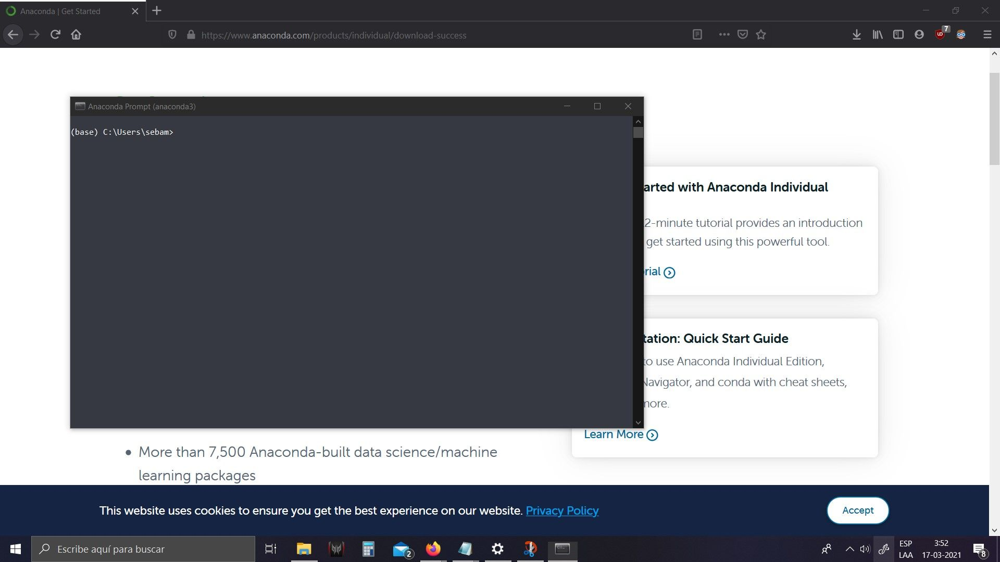
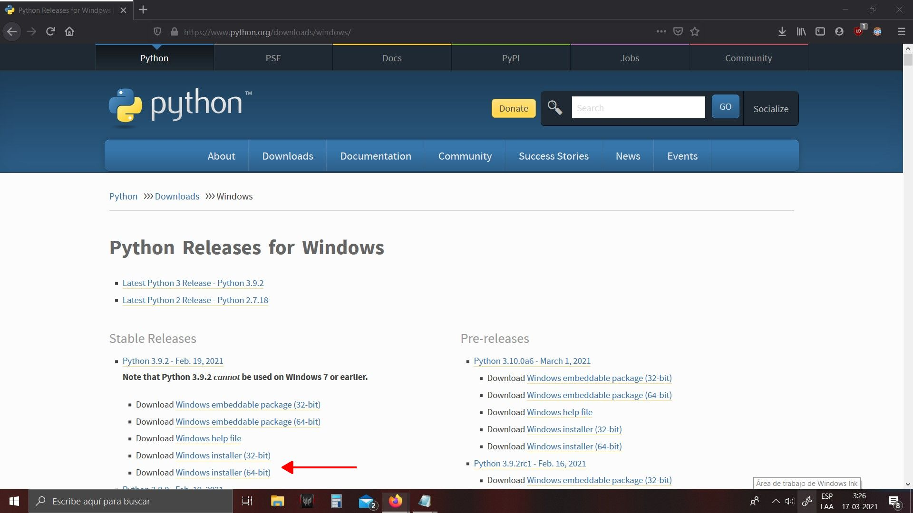
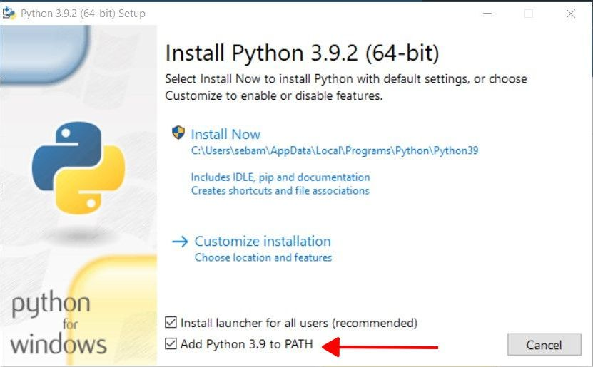
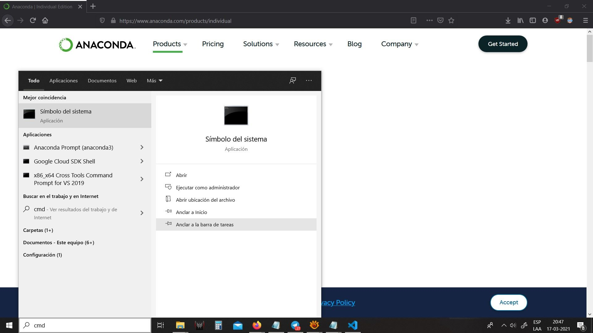

|
Instalación de python y librerias en Windows
=======

En windows, python no viene instalado por defecto, y a pesar de ser posible instalar python y librerías de versiones específicas de librerías manualmente, no es recomendado por el trabajo que implica.

Algunas observaciones:

- Python se puede instalar a nivel de sistema o a nivel de usuario.
- Ej: Algunos programas pueden usar una versión dedicada e interna de Python.
- Es posible instalar muchas versiones de python en un mismo sistema. La versión que se desea mantener disponible para otras aplicaciones debe mantenerse en el path de sistema o del usuario.

Vamos a ofrecer dos posibilidades, utilizando Anaconda y utilizando Python nativamente.

- Se recomienda utilizar Anaconda en el espacio de usuario, es la forma menos invasiva y no requiere permisos de administrador de sistema.
- Anaconda permite la instalación de múltiples librerías (python package installer) con versiones que son compatibles entre sí.
- Estas librerías son instaladas utilizando versiones ya compiladas (vía el comando "conda"), esto previene un exceso de dependencias que puede costar satisfacer para distintas librerías.
- Anaconda puede manejar distintas versiones de python (Ej: 2.7, 3.6, etc.) y "environments".
- Distintos environments pueden poseer distintas librerías instaladas, dichas librerías pueden ser incluso incompatibles entre sí.

Si por determinadas razones, tienen problemas con la instalación de Anaconda, pueden intentar con una instalación de Python nativo. Esto también funcionará, pero el manejo de distintas versiones de python se deberá realizar de forma manual. También se requerirá esfuerzo adicional para mantener dependencias externas a python (archivos .dll). El día de mañana, podría requerir una nueva librería, que quizá sea incompatible con otra, por lo que al instalarla, pueden dejar de funcionar sus programas antiguos.

---

## Instalando Anaconda (Recomendado)

Anaconda Distribution, permite administrar paquetes de python de manera similar a como se realiza en linux.

Primero descargue e instale anaconda python versión 3.8 en https://www.anaconda.com/products/individual#Downloads

Marque la segunda opción y termine la instalación

Creando un environment
----------------------

Ahora necesita trabajar con la terminal de Anaconda "Anaconda Prompt" escribiendo en el buscador.

Donde se abrirá una terminal como la que se muestra

En dicha terminal creamos un environment ejecutando:

    conda create -n python-cg

Luego lo activamos con

    conda activate python-cg

Aparecerá (python-cg) al lado izquierdo de su prompt indicando que este es el environment activo. Puede volver al environment base con

    conda activate base

En cualquier momento, usted puede ver una lista con todos sus environments utilizando el comando:

    conda info --envs

Debiera ver una lista con 'base' y 'python-cg'.

Si comete algún error, puede eliminar un environment y todas sus librerias con

    conda remove --name python-cg --all

y luego realizar una nueva configuración.

Instalando las librerías necesarias
-----------------------------------

Regrese al environment python-cg, una vez ahí ejecute el siguiente comando para ver si está instalado pip:

    pip

Si no arroja error o no encontrado puede seguir, de lo contrario tiene que instalar pip con el comando:

    conda install pip

Ahora si puede instalar las librerías:

    pip install numpy scipy matplotlib pyopengl glfw ipython jupyter pillow imgui[glfw] pyglet trimesh networkx

Es posible que se le pida actualizar algunas dependencias, ingrese 'y' para aceptar.

# Python Nativo (Si el método anterior no funciona)

Si usted ya tenía Python instalado con Anaconda y tuvo problemas, seguramente se trata de un problema con las variables de entorno. En ese caso, usted querrá desinstalar Python en conjunto con Anaconda. Haga esto manualmente.

Ahora, deberá instalar Python para que se agregue a sus variables de entorno:

Descargar e instalar la última versión estable de Python para Windows desde https://www.python.org/downloads/windows/ segun el procesador de su computador (32 o 64 bits).

Luego abra el ejecutable y realice la instalación, donde es importante que añada python al path, marcando la opción.  POR FAVOR NO OLVIDE ESTO. SI LO HACE ¡REINSTALE!

Una vez instalado, asegúrese de que python funciona. Abra alguna terminal de windows (windows-> buscar o ejecutar -> cmd).

Luego escriba en la terminal

    python

Debería aparecer algo del estilo:

    Python 3.7.2(default, Sep 12 2018, 18:26:19)
    [GCC 8.0.1 20180414 (experimental) [trunk revision 259383]] on linux
    Type "help", "copyright", "credits" or "license" for more information.
    >>>

Nosotros no queremos estos >>>, pues es para programar en Python (sería bastante incómodo programar en la terminal). Se puede salir de este ambiente escribiendo:

    >>>exit()

Así volverá a la terminal normal. Es posible que Python haya instalado el paquete pip, que permite administrar e instalar otros paquetes fácilmente. Para comprobarlo, escriba:

    pip

En la terminal. Si se despliega un menú con opciones, está todo bien. Si no figua como algo determinado, deberá instalarlo, para esto hay que ejecutar el módulo get-pip.py (revisar el link https://www.liquidweb.com/kb/install-pip-windows/). Este módulo se puede ejecutar tal como se hacía en el curso de Introducción a la Programación, abriendo el IDLE y corriéndolo.

Ahora sí debería tener pip, proceda a escribir

    pip install numpy scipy matplotlib pyopengl glfw ipython jupyter pillow imgui[glfw] pyglet trimesh networkx

Y ahora debería poder correr todos los programas normalmente.
