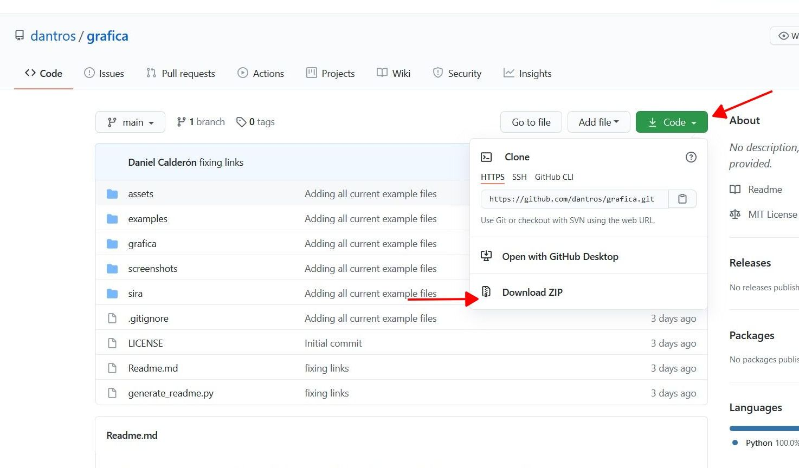

|
Descargando los archivos
=======

Primero debe descargar los archivos y códigos que se usarán en el curso, para esto, debe dirigirse al repositorio https://github.com/dantros/grafica, descargar el .zip y descomprimirlo

Pero si cuenta con el sistema de control de versiones Git instalado, es preferible que haga ``git clone`` del repositorio

Probando la instalación
=======================

Ya sea en Windows o Linux, en una terminal con el environment de python activo, abra el directorio de los archivos .py que usted desea ejecutar desde la terminal con el comando

    cd <directorio donde se encuentra el archivo .py>

Luego ejecute algunos de los archivos de ejemplo disponibles la carpeta examples:

---

    python ex_color_palette.py 

Imagen de Santiago con dos paletas de colores distintas vía matplotlib

---

    python ex_delaunay.py 

Puntos conectados, se utiliza scipy

---

    python opengl_version.py   

Imprimirá en la terminal la versión de OpenGL disponible en su sistema. Si es 3.x es su día de suerte, si es 2.x hay algunos códigos de iluminación que no podrá ejecutar, pero no es un problema mayor.

---

    python ex_quad.py

Triángulo con degradación de colores utilizando opengl y glfw

Si pudo ejecutar y visualizar todos los programas anteriores ¡Felicitaciones! ya tiene todo lo necesario para trabajar los contenidos del curso.

Observación:
============

Para ejecutar archivos "jupyter notebooks", debe ir a la terminal y escribir:

    jupyter notebooks
