# Setup con Visual Studio Code

## ¿Qué es Vs code?

Visual Studio Code es un editor de código fuente gratuito y de código abierto, compatible con una multitud de lenguajes de programación y herramientas mediante la instalación de extensiones, además de características bastantes útiles en la práctica como control de git, refactorización, finalización inteligente de código y soporte para debuggear/depurar como se verá al final de este documento.

## ¿Es necesario?

No, podría usar el terminal y un editor de texto para trabajar en sus tareas, pero es altamente recomendable usar un editor de texto para agilizar el proceso de escribir código e ir probando el resultado de su código. Se recomienda en particular este IDE ya que es el que utiliza el cuerpo docente y por lo tanto es el que se verá en clases, pero podría usar cualquier otro como PyCharm o Spyder si tiene experiencia

## Instalación en Windows

Primero descargue vs code en el siguiente enlace: https://code.visualstudio.com/

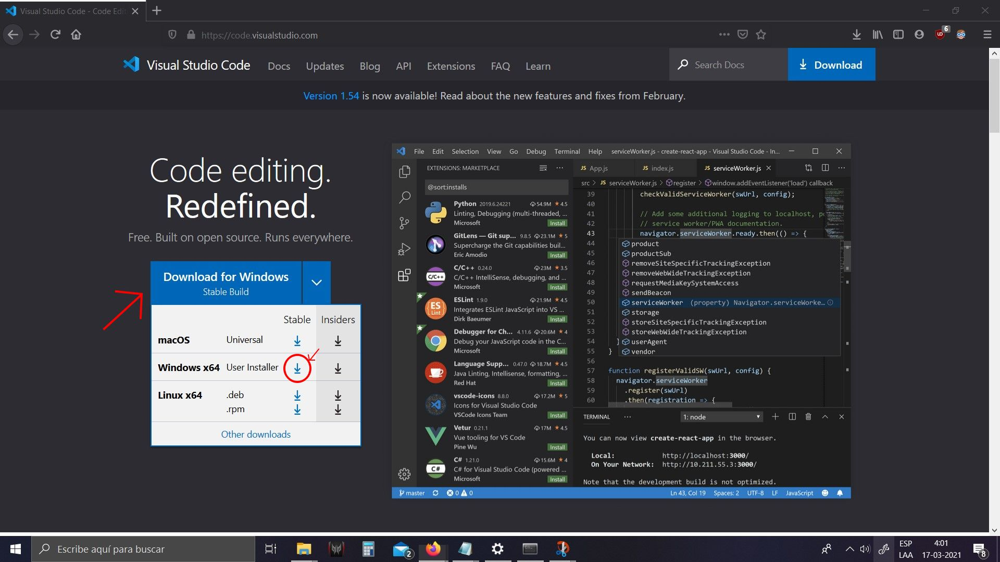

Proceda a la instalación, recordando marcar la opción de agregar al path, esto para poder iniciar vs code desde una terminal con el comando ``code .`` (o el directorio deseado).

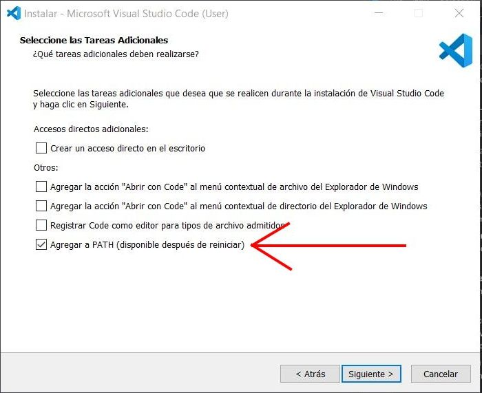

Luego de reiniciar su computador (para hacer efectivo la adición del path), abra visual studio code e instale la extensión de python como se aprecia en la imagen de abajo.

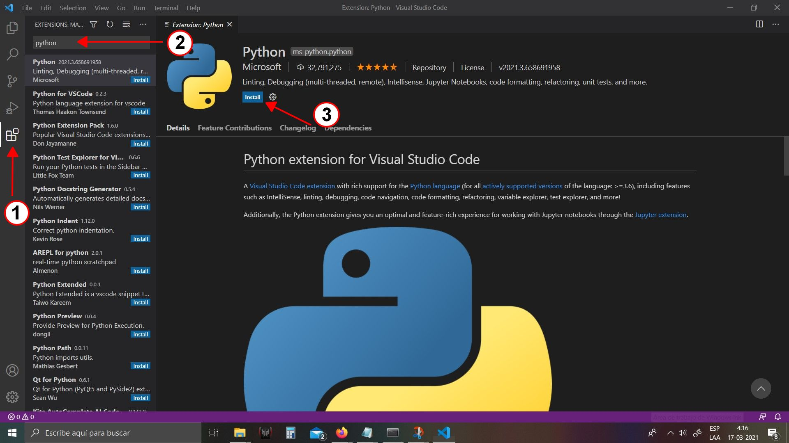

Ahora tiene que abrir una carpeta donde tenga algun codigo de python

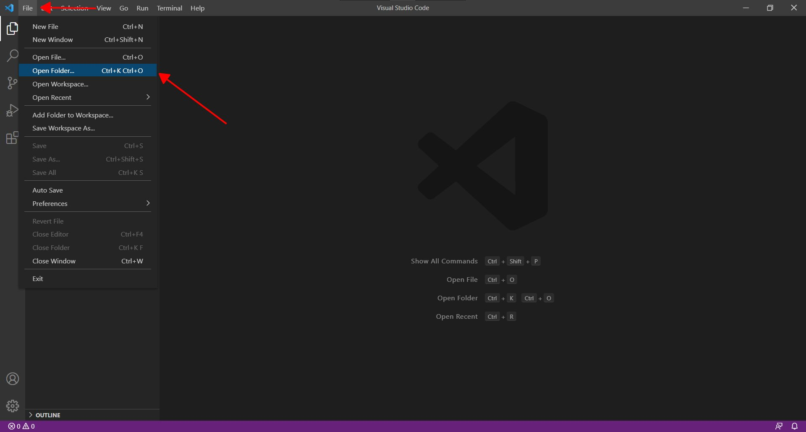

Si realizo la instalacion de librerias con python nativo (No recomendado) el intérprete es el que viene por defecto, por lo que ya está configurado, si usa anaconda, seleccione el intérprete de la siguiente manera:

1. Seleccione un archivo python
2. Espere a que el programa termine de detectar el lenguaje y presione la barra azul en la esquina inferior izquierda
3. Seleccione el intérprete del environment que creó con Anaconda
4. Presione el símbolo verde para ejecutar el código con el ambiente

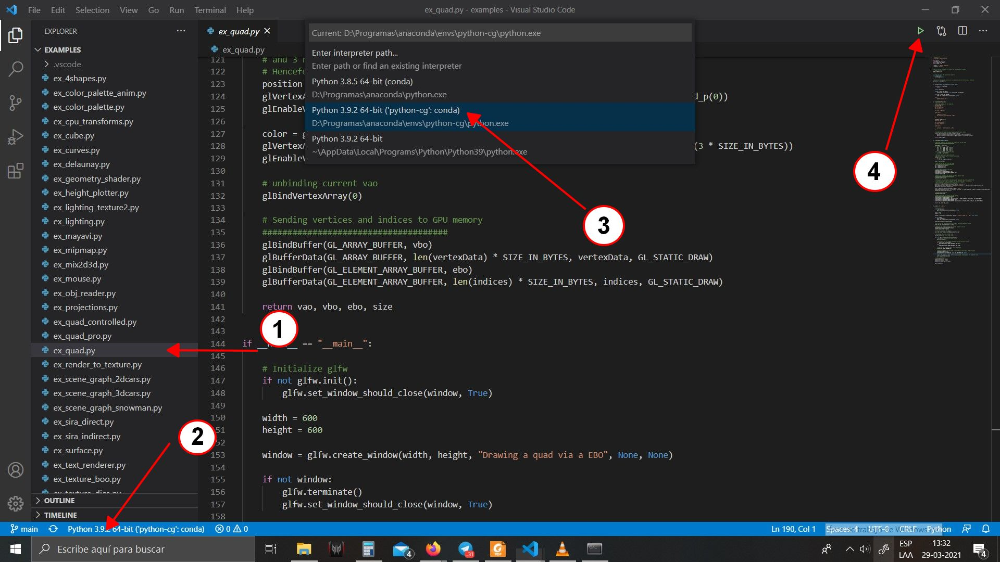

Se verá la ejecución del código, en este caso de ``ex_quad.py``

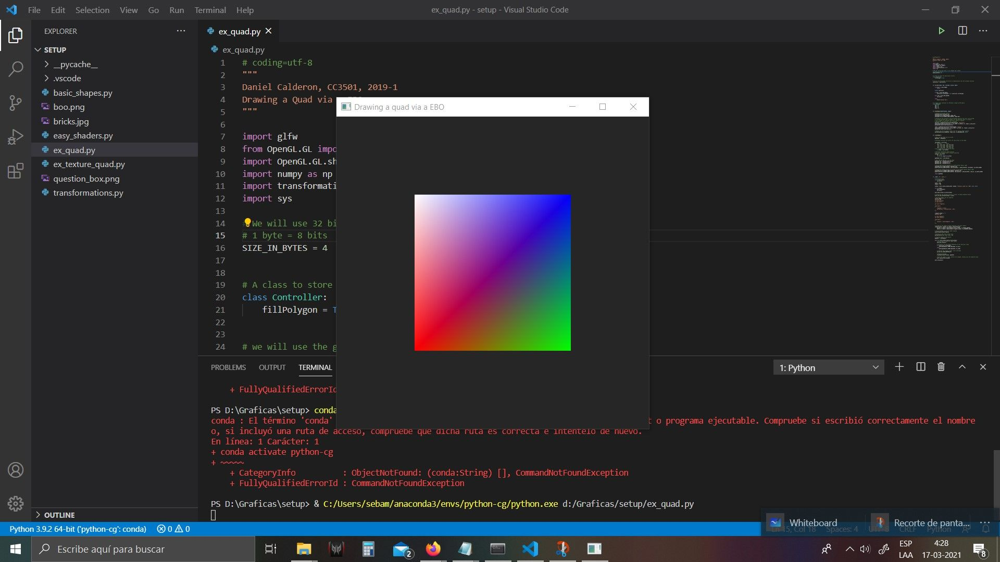

Preste atención en el terminal que se muestra al ejecutar el código, debería verse como la imagen de abajo (como el terminal Anaconda Prompt)

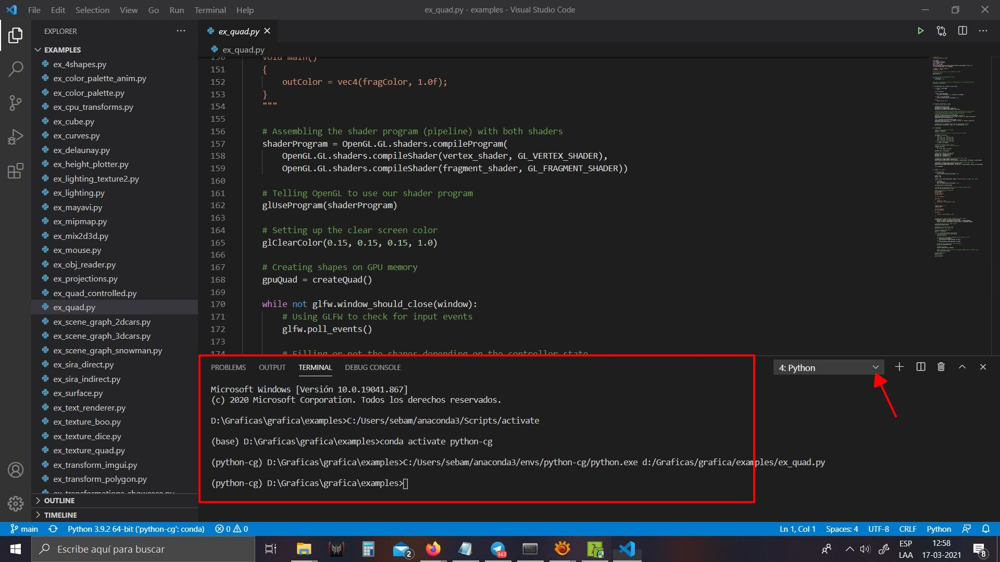

En caso contrario trate de cambiar el terminal donde está señalando la flecha a cmd/python/conda si solo sale powershell realice lo siguiente:

- Cierre visual studio Code
- Abra Anaconda Prompt
- Active su environment
- diríjase al directorio del archivo de prueba con: ``cd <directorio>``
- Ejecute el comando: ``code .``
- Al abrir su código debiese poder elegir la terminal de anaconda, si todavía no, debe crear una nueva terminal como sale en la imagen inferior.

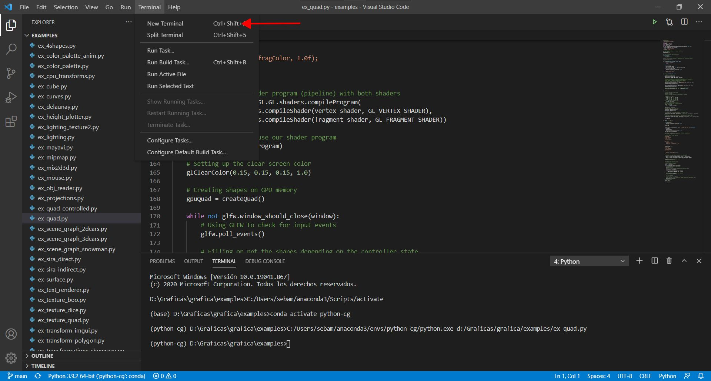

Por último si sale el mensaje de que linter no está instalado, seleccione ``install`` y luego elija la opción de instalar con pip.

# Instalacion en Linux

Primero debe descargar los archivos de https://code.visualstudio.com/Download, Luego en la terminal ejecute el comando

    sudo apt install ./<file>.deb

donde <file> es el archivo descargado

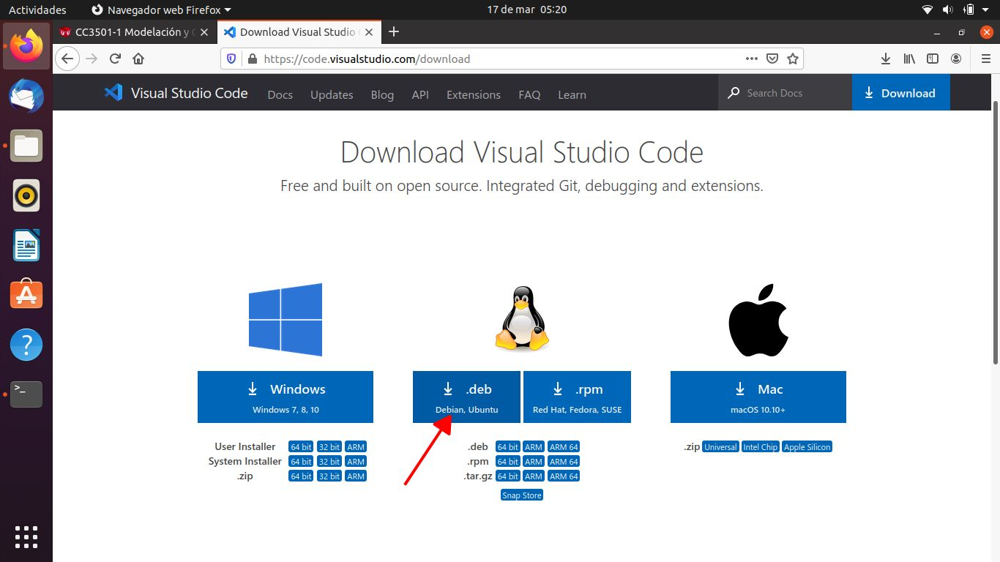

Instale la extensión de python

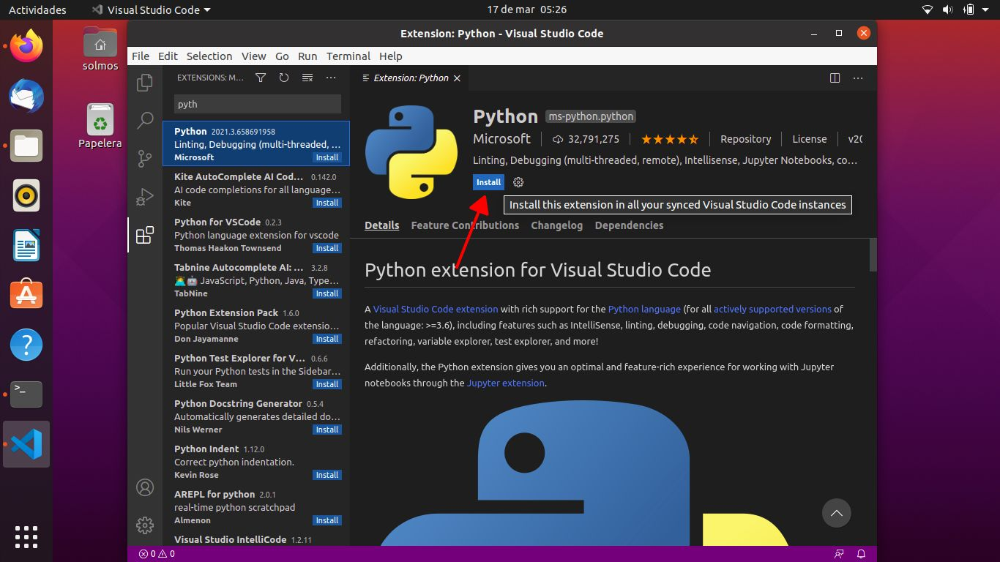

Abre la carpeta donde se encuentre los codigos a ejecutar

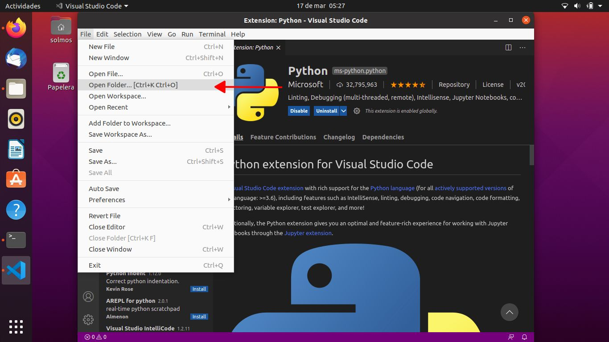

De la misma manera que con windows, ahora tiene que elegir el intérprete:

1. Seleccione un archivo python
2. Espere el análisis y apriete la barra en la esquina inferior izquierda
3. Lo mas probable es que no se vea el intérprete instalado, por lo que toca buscar el path

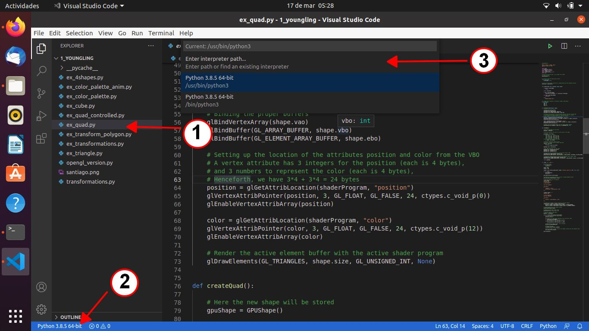

Si realizo la instalación como en el tutorial anterior, debería estar ubicado en un lugar equivalente, seleccione ``python3`` y luego ``Select Interpreter``

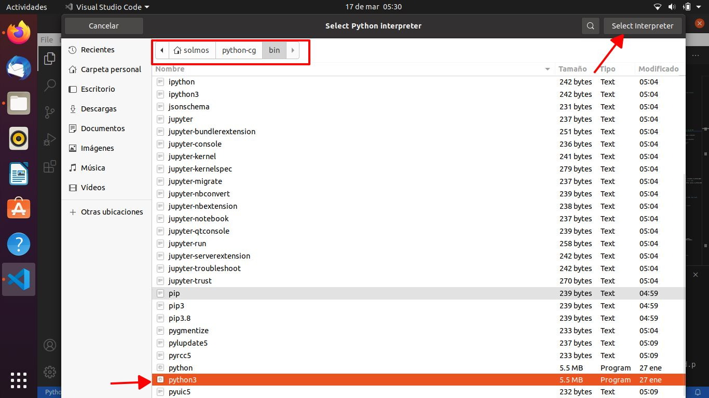

Ya debería ser capaz de ejecutar los códigos con el símbolo verde que se encuentra en la parte superior derecha.

## ¿Como hacer debug?

Primero que todo, hacer debug o depurar es el proceso de buscar errores en el código del programa, a través de herramientas que permite la inspección de las variables globales y locales al controlar la ejecución y la detención del código en las líneas que se desee. Visual studio code provee una herramienta de depuración bastante intuitiva y cómoda que les puede servir para ver en qué está fallando el código, en qué parte está el error, o si las variables son las esperadas.

Para realizar esto primero hay que ubicar los breakpoints, que son las líneas marcadas en donde se quiere que la ejecución del código se detenga (y no se ejecute completamente), estos se representan con un punto rojo como se ve en la imagen inferior, y se pueden colocar, remover al hacer click izquierdo al lado izquierdo de los numeros de lineas, en la parte señalada con el rectángulo rojo.

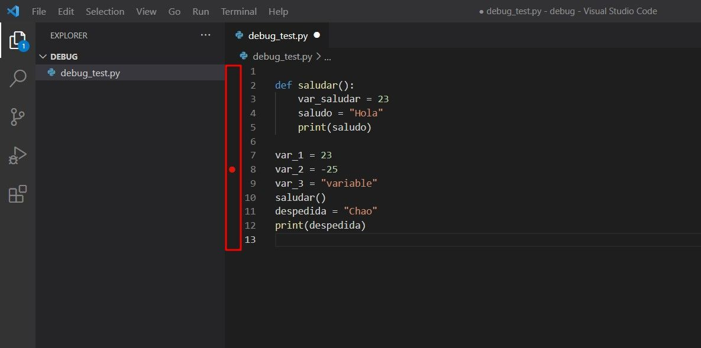

Luego para ejecutar la depuración, puede seleccionar en la barra superior Run, Start debugging, o apretar F5, luego seleccione Python File

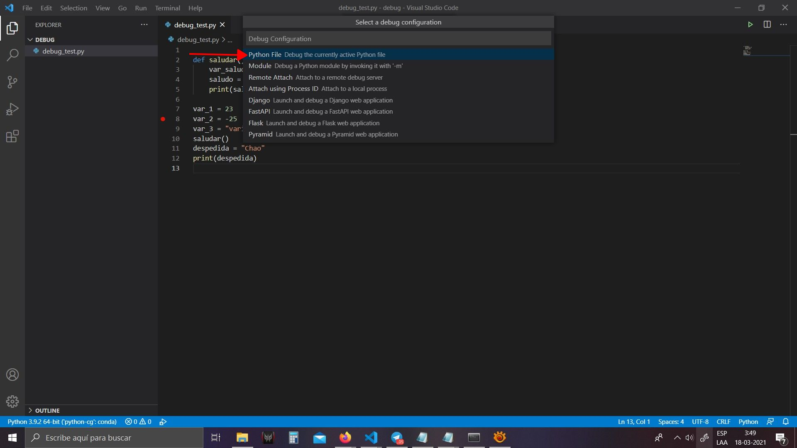

Ahora estara en modo debug, donde la linea maracada en amarillo indica la posicion actual en la que se encuentra la ejecucion y que en un principio estara en el primer breakpoint marcado.

Aparecerá un barra en la parte superior para controlar la depuración, estos símbolos representan de izquierda a derecha:

- Continue: ejecutará el resto del código hasta encontrar otro breakpoint.

- Step Into: Ejecuta la línea en que se encuentra, si hay una llamada a una función, el depurador se ubicará en la primera línea de la función, en este caso se ubicará en la primera línea de la función saludar())
-Step Over: Ejecuta la línea en la que se ubica, si es una función, la ejecuta, pero el depurador no entra en la función, por lo que pasa a la siguiente línea, en nuestro caso pasa a la línea 13, pero en la terminal se imprime "Hola" porque ejecuto la función saludar()
- Step Out: Ejecuta el código hasta el fin de la función actual, se usa cuando no se quiere seguir depurando lo que queda de función.
- Reset: es para reiniciar la depuración, se vuelve al primer breakpoint.
- Stop: Detiene la depuración.

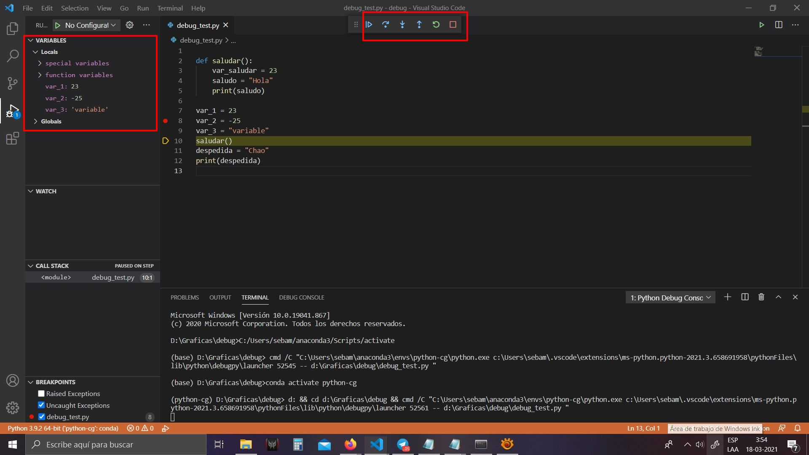

Por último, como se ve en la imagen superior, en la parte de la izquierda se pueden ver el valor de las variables que tiene al estar depurando. Lo cual es útil para ver si las variables tienen los valores esperados o se tiene un error con ellos.
